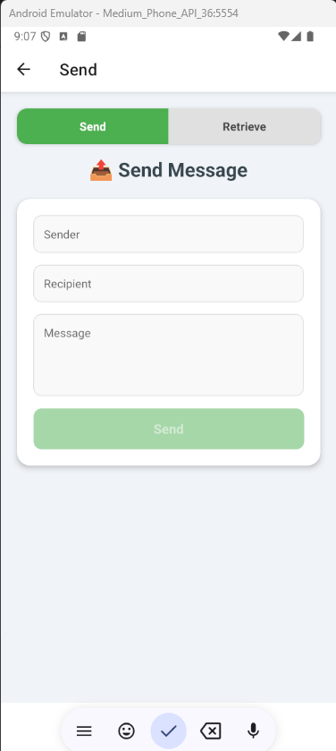
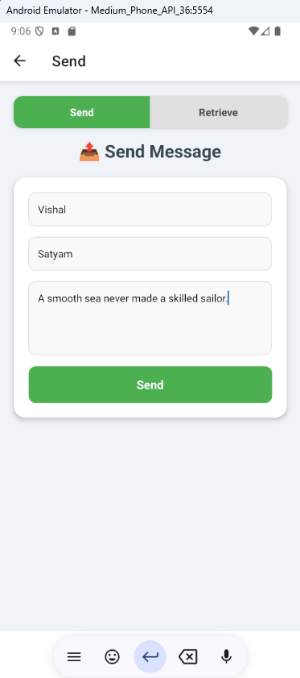
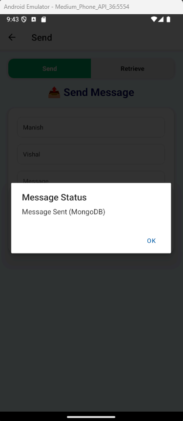
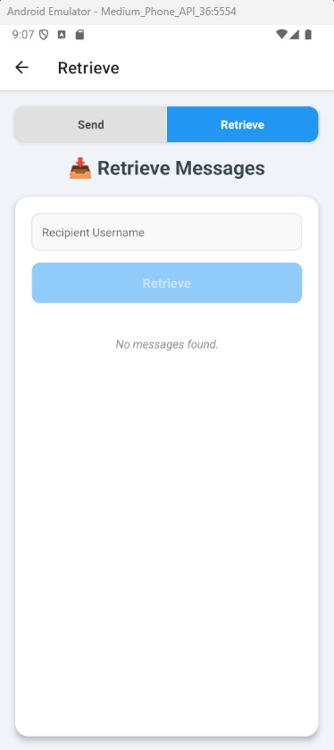
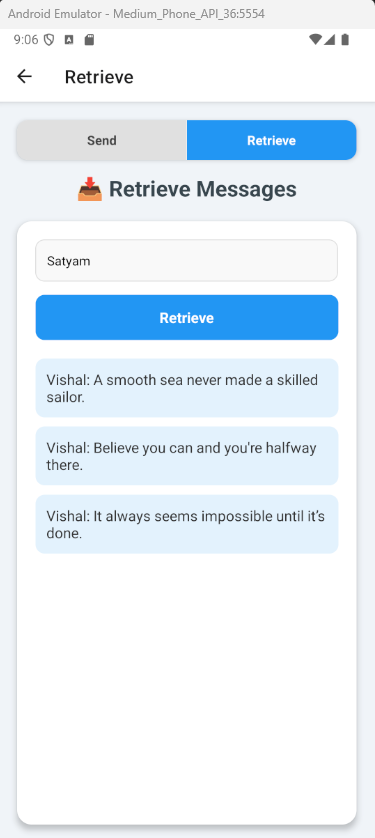
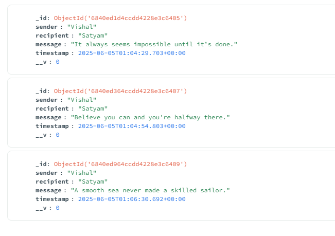

# Simple Messaging App

**Team Members:**

- Manish Chandrashekar(mc4484)
- Satyam Kumar(sk4343)
- Vishal Hagargundgi(vh347)

## Introduction

This app is a simple messaging tool built using **React Native** and **Node.js** with a **MongoDB** backend. It allows users to send and retrieve short messages using usernames. It is designed for educational purposes and is ideal for demonstrating basic mobile-to-server communication, RESTful API usage, and database interaction in a full-stack project.

**Purpose:** Demonstrate client-server communication in mobile app development.

**Target Audience:** Students learning full-stack development with React Native and RESTful APIs.

---

## Front-End (React Native)

The mobile application includes:

- Two main screens: **Send Message** and **Retrieve Messages**
- Custom navigation tabs
- Input validation with user-friendly alerts
- Modern UI with clean layout

### Screens

1. **Send Message Screen**

   - Users enter sender, recipient, and message.
   - Sends message to the server via a POST request.

2. **Retrieve Messages Screen**
   - Users enter a recipient's name to retrieve messages via a GET request.

### Screenshots

#### Send Message Screen







---

#### Retrieve Messages Screen





---

## Server APIs (Node.js + Express)

The backend server uses Express to provide RESTful APIs, and MongoDB to store and retrieve messages.

### API Endpoints

#### **POST `/sendMessage`**

Sends a message from one user to another.

- **Request Body (JSON):**

  ```json
  {
    "sender": "Vishal",
    "recipient": "Satyam",
    "message": "Hello!"
  }
  ```

- **Response:**

  ```json
  {
    "status": "Message Sent (MongoDB)"
  }
  ```

- **Error Response:**
  ```json
  {
    "status": "Failed to save message"
  }
  ```

---

#### **GET `/retrieveMessages?recipient=username`**

Retrieves all messages for the specified recipient, sorted by most recent.

- **Query Parameter:**

  - `recipient` – (required) username of the message recipient

- **Example URL:**

  ```
  http://localhost:3000/retrieveMessages?recipient=bob
  ```

- **Response:**

  ```json
  {
    "messages": ["Vishal: Hello Manish!", "Manish: Meeting Stayam?"]
  }
  ```

- **Error Response:**
  ```json
  {
    "messages": []
  }
  ```

---

## Database Schema (MongoDB)

The `messages` collection stores each message with the following schema:

| Field       | Type   | Description                      |
| ----------- | ------ | -------------------------------- |
| `sender`    | String | Username of the message sender   |
| `recipient` | String | Username of the message receiver |
| `message`   | String | The content of the message       |
| `timestamp` | Date   | Time the message was sent        |

Mongoose Schema Definition:

```js
const messageSchema = new mongoose.Schema({
  sender: String,
  recipient: String,
  message: String,
  timestamp: { type: Date, default: Date.now },
});
```

MongoDB:

## 
